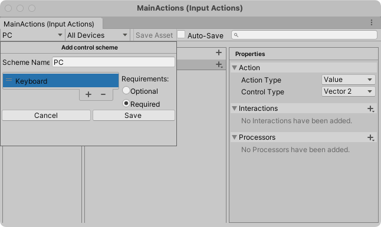

# Warrior2021
듀코젠 InputSystem 프로젝트

마지막 수업시간에서 오류가 발생한 부분은 Control Scheme 추가하는 곳에
Keyboard를 추가하지 않아서 입력값이 들어오지 않았습니다. 다음 그림과 같이
+를 클릭해 Keyboard를 추가하시며 정상적으로 입력값이 들어옵니다.
수업에 참여하신 모든 분들께 감사의 말씀드립니다.

